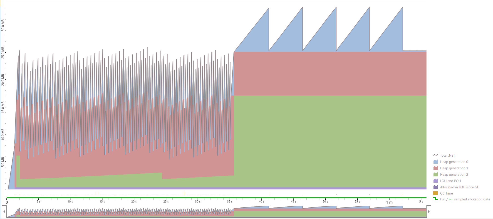
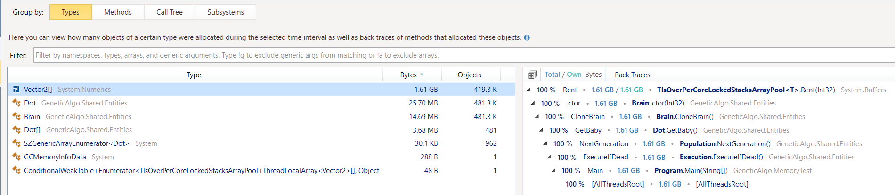
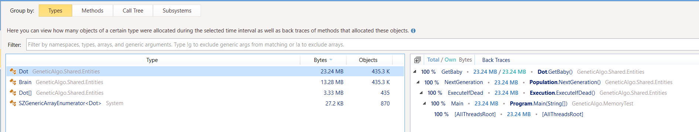

# Reproduce for ArrayPool allocations

Comparing using ArrayPool<Vector2>.Shared and instance created with ArrayPool<Vector2>.Create.

```csharp
private static readonly ArrayPool<Vector2> CreatedPool = ArrayPool<Vector2>.Create(Settings.StepsCount, 4000);

public static ArrayPool<Vector2> GetPool()
{
    if (UseShared)
        return ArrayPool<Vector2>.Shared;

    return CreatedPool;
}
```

Code in main is look like this:

```csharp
Execute();
AllocationMode.UseShared = false;
Execute();
```

## Benchmark

BenchmarkDotNet=v0.13.1, OS=Windows 10.0.22000
AMD Ryzen 7 5800H with Radeon Graphics, 1 CPU, 16 logical and 8 physical cores
.NET SDK=7.0.100-preview.4.22252.9
  [Host]     : .NET 6.0.5 (6.0.522.21309), X64 RyuJIT
  DefaultJob : .NET 6.0.5 (6.0.522.21309), X64 RyuJIT


| Method | UseShared |     Mean |   Error |  StdDev |     Gen 0 |     Gen 1 | Allocated |
|------- |---------- |---------:|--------:|--------:|----------:|----------:|----------:|
|   Read |     False | 274.1 ms | 4.16 ms | 5.96 ms |         - |         - |      5 MB |
|   Read |      True | 292.4 ms | 4.52 ms | 3.78 ms | 4000.0000 | 2000.0000 |     39 MB |

## dotMemory

DotMemory trace with changing allocation mode:



Allocated objects while we using `ArrayPool<Vector2>.Shared`:



Allocated objects while we using pool form `ArrayPool<Vector2>.Create`:


